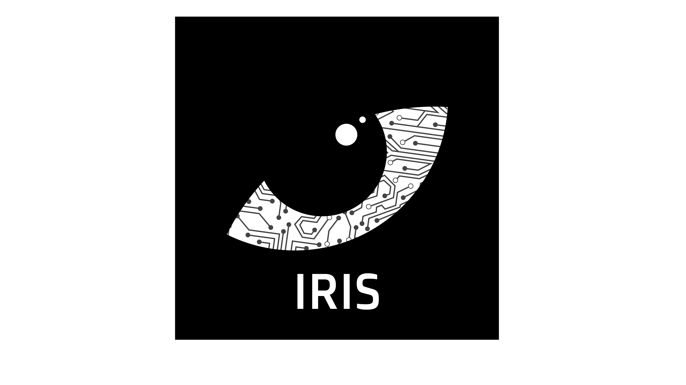
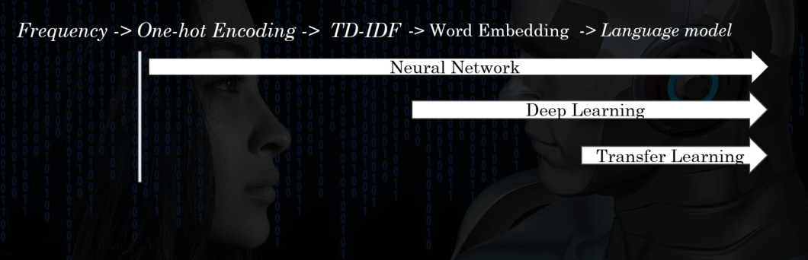
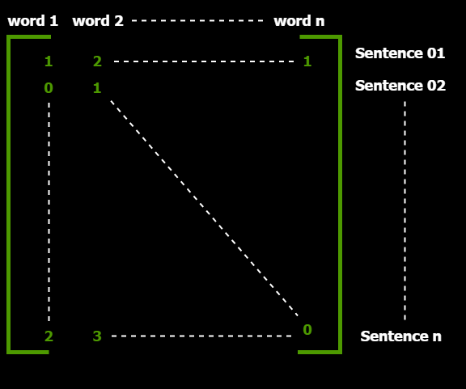

<h1 align="center">IRIS NLP SYSTEM</h3>

Everything about NLP at IRIS-ROBOTICS (IPSA PARIS)  
 
# What is NLP?

> NLP stands for Natural Language Processing. The main goal of NLP is to 
> use algorithm to encode/decode our natural language (french for example).

###GOAL: 

* Make AI chat bots to help IPSA's students

# Encoder Models
Here is a list of different encoding types for NLP:

As of today, we only programmed the One-Hot Encoder.
This one will be explained in the next section.

# Tokenizer

> The Tokenizer as its name suggest, tokenize all words in a text.
> Those words will be part of our **Matrix** output. But, they need to go through different process 
> before this.

## Pre-Process
During **Pre-processing**, text must be splitted into sentences. Those sentences will be again splitted into
a list of words. 

After this, the **Tokenizer** program removes **Stopwords**, and use **Stemming** to keep only **base words**.

## Stemmer

The IrisStemmer follows basic rules in french to stem all words given.

Examples:
* Removing X
* Replacing words ending with AUX with AL

  | Before Stem       | After Stem         
  |:-------------|:------------------
  | Chevaux      | Cheval
  | Belle        | Bel
  | Bouygues     | Bouygu      
  | Assouplissement  | Assoupl

## One-hot Encoder

We use this encoder to make a **NxM matrix** which will contain every word occurences
within the text given.

This matrix will look like:

where numbers represent the word occurence in a sentence.

# Next Goal

The next goal is to make a Word Embedding encoder using our One-Hot Encoder.